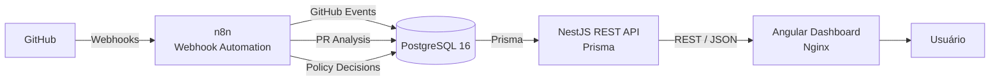
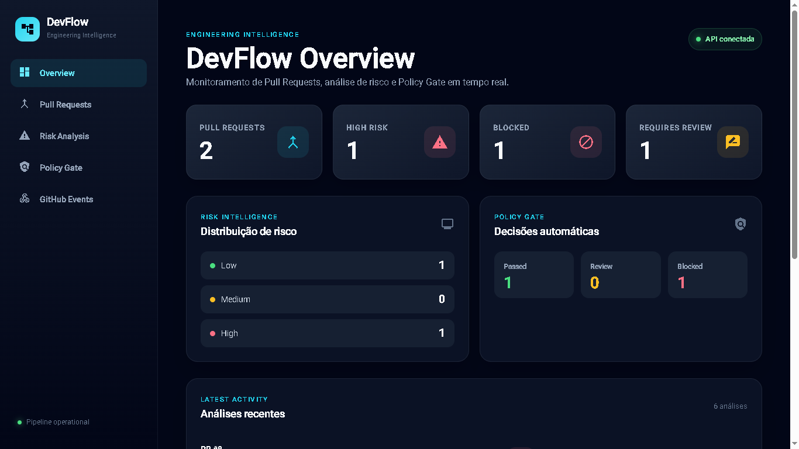
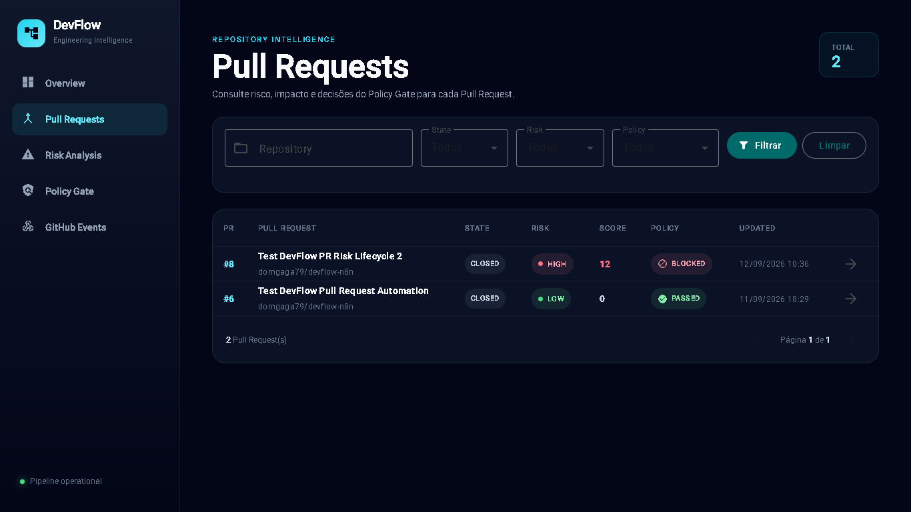
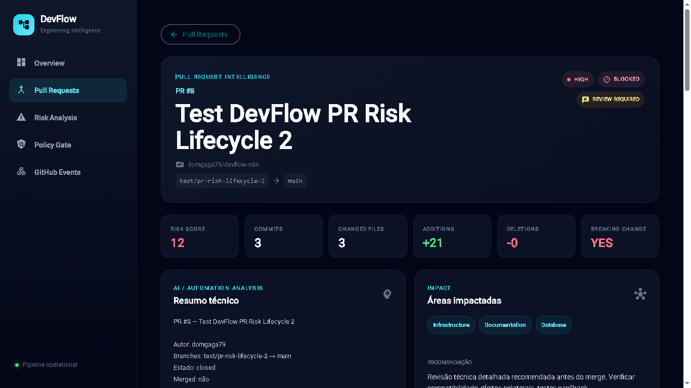
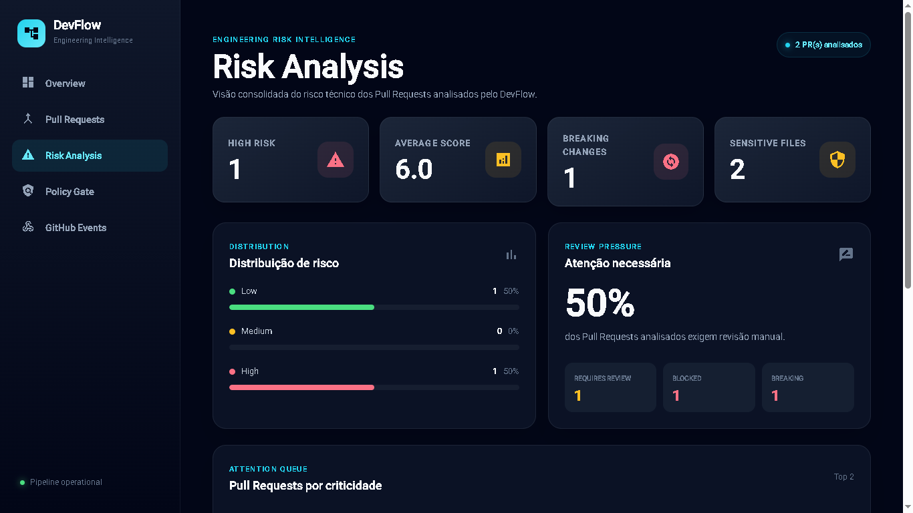
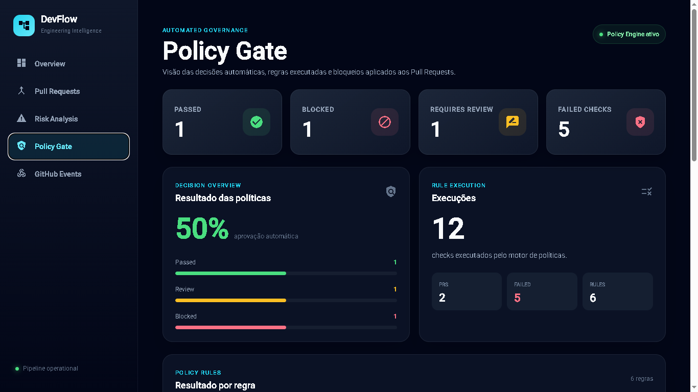
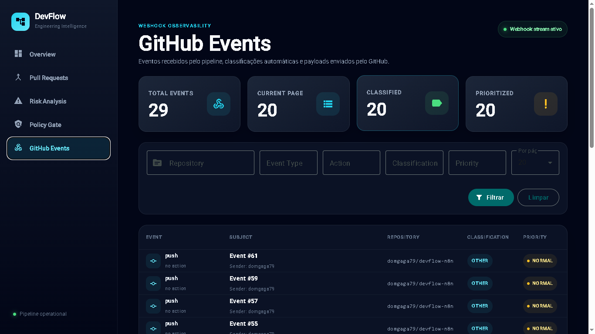
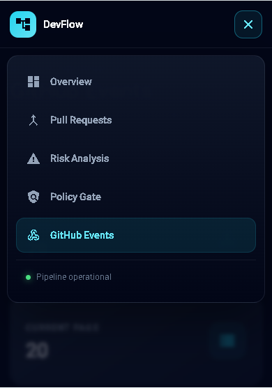

# DevFlow

<p align="left">

[](https://github.com/domgaga79/devflow-n8n/actions/workflows/ci.yml)

[](https://github.com/domgaga79/devflow-n8n/actions/workflows/cd.yml)


[](https://github.com/domgaga79/devflow-n8n/releases/latest)


[](https://github.com/domgaga79/devflow-n8n/actions/workflows/security.yml)


</p>

> Plataforma de Engineering Intelligence para análise automatizada de Pull Requests, classificação de eventos do GitHub, avaliação de risco e aplicação de Policy Gates.

DevFlow integra **GitHub, n8n, PostgreSQL, NestJS, Prisma e Angular** em uma arquitetura orientada a eventos para transformar atividades de desenvolvimento em informações técnicas úteis para tomada de decisão.

O projeto recebe webhooks do GitHub, valida a autenticidade dos eventos, analisa Pull Requests, calcula nível de risco, identifica alterações sensíveis, aplica políticas de engenharia e disponibiliza os resultados através de uma API REST e de um dashboard responsivo.

---

## Visão geral

O DevFlow foi desenvolvido como um projeto Full Stack com foco em:

- automação de processos de engenharia;
- arquitetura orientada a eventos;
- segurança de webhooks;
- análise de Pull Requests;
- observabilidade;
- políticas automatizadas;
- APIs REST;
- persistência relacional;
- testes automatizados;
- containerização com Docker;
- frontend responsivo.

O objetivo é demonstrar uma arquitetura próxima de um cenário real de engenharia de software, indo além de um CRUD tradicional.

---

## Arquitetura



### Fluxo principal

```text
GitHub
   ↓
Webhook
   ↓
n8n
   ↓
HMAC Validation
   ↓
Normalization
   ↓
Risk Analysis
   ↓
Policy Gate
   ↓
PostgreSQL
   ↓
NestJS + Prisma
   ↓
Angular Dashboard
```

---

# Principais funcionalidades

## GitHub Webhooks

O DevFlow recebe eventos enviados pelo GitHub através de workflows no n8n.

Entre os eventos tratados estão:

- Issues
- Pull Requests
- Push
- eventos relacionados ao repositório

Os eventos recebidos são persistidos para auditoria e observabilidade.

---

## Validação HMAC

Os webhooks são validados utilizando:

```text
X-Hub-Signature-256
```

O pipeline calcula:

```text
HMAC SHA-256
```

sobre o payload original enviado pelo GitHub.

Eventos com assinatura inválida são rejeitados antes de qualquer processamento.

```text
GitHub
   ↓
Raw Payload
   ↓
HMAC SHA-256
   ↓
Signature Validation
   ├── inválida → 401
   └── válida   → processamento
```

---

# Pull Request Intelligence

Para Pull Requests, o DevFlow coleta informações técnicas como:

- quantidade de commits;
- quantidade de arquivos alterados;
- linhas adicionadas;
- linhas removidas;
- arquivos sensíveis;
- áreas impactadas;
- possíveis breaking changes;
- score de risco;
- nível de risco;
- necessidade de revisão;
- resultado do Policy Gate.

Exemplo:

```text
Pull Request #8

Risk Level       HIGH
Risk Score       12
Commits           3
Changed Files     3
Additions        21
Deletions         0

Breaking Change  YES
Requires Review  YES
Policy Status    BLOCKED
```

---

# Risk Analysis

Cada Pull Request recebe uma classificação de risco.

Os níveis disponíveis são:

```text
LOW
MEDIUM
HIGH
```

A análise pode considerar fatores como:

- volume de alterações;
- quantidade de arquivos;
- commits;
- arquivos sensíveis;
- alterações de infraestrutura;
- mudanças de banco de dados;
- mudanças em workflows;
- breaking changes.

O dashboard apresenta também uma visão agregada da distribuição de risco.

---

# Policy Gate

O Policy Gate transforma a análise técnica em uma decisão automatizada.

Exemplos de decisões:

```text
PASSED
BLOCKED
```

A necessidade de revisão é tratada separadamente:

```text
requires_review = true
```

Isso permite cenários como:

```text
Policy Status: BLOCKED
Requires Review: YES
```

O sistema também mantém histórico das análises realizadas sobre cada Pull Request.

---

# GitHub Events

Todos os eventos processados podem ser consultados através do dashboard.

A tela oferece:

- paginação;
- filtro por repositório;
- filtro por tipo de evento;
- filtro por action;
- filtro por classificação;
- filtro por prioridade;
- identificação do remetente;
- visualização do payload original;
- link para o GitHub quando disponível.

---

# Dashboard

O frontend foi desenvolvido utilizando Angular e Angular Material.

Áreas disponíveis:

```text
Overview
Pull Requests
Pull Request Details
Risk Analysis
Policy Gate
GitHub Events
```

O layout foi desenvolvido com foco em uma interface de engenharia/DevOps.

---

## Responsividade

O dashboard foi adaptado para:

```text
Desktop
Notebook
Tablet
Mobile
```

No mobile:

- sidebar é transformada em menu hamburger;
- filtros são reorganizados;
- cards utilizam layout vertical;
- tabelas utilizam scroll horizontal interno;
- navegação permanece acessível;
- dialogs são adaptados para telas menores.

---

# Stack

## Backend

| Tecnologia | Uso |
|---|---|
| Node.js | Runtime |
| NestJS | API REST |
| TypeScript | Linguagem |
| Prisma | ORM |
| PostgreSQL | Banco de dados |
| Swagger | Documentação da API |
| Vitest | Testes |
| Docker | Containerização |

---

## Frontend

| Tecnologia | Uso |
|---|---|
| Angular | SPA |
| TypeScript | Linguagem |
| Angular Material | UI |
| SCSS | Estilização |
| Signals | Estado reativo |
| RxJS | Fluxos assíncronos |
| Vitest | Testes |
| Nginx | Servidor de produção |

---

## Automação

| Tecnologia | Uso |
|---|---|
| n8n | Orquestração |
| GitHub Webhooks | Eventos |
| HMAC SHA-256 | Validação |
| GitHub API | Dados adicionais de Pull Requests |

---

## Infraestrutura

O ambiente do DevFlow é totalmente containerizado e possui pipeline automatizado de integração, segurança e publicação de imagens.

| Tecnologia | Uso |
|---|---|
| Docker | Containerização da API e Dashboard |
| Docker Compose | Orquestração do ambiente local |
| PostgreSQL 16 | Persistência dos dados |
| Nginx | Servidor do frontend Angular em produção |
| GitHub Actions | CI/CD e verificações de segurança |
| GitHub Container Registry | Publicação das imagens Docker |

### CI/CD

O pipeline de CI executa automaticamente em Pull Requests e atualizações da `main`.

```text
Pull Request
     │
     ├── API
     │   ├── npm ci
     │   ├── Prisma generate
     │   ├── testes + coverage
     │   └── build NestJS
     │
     ├── Dashboard
     │   ├── npm ci
     │   ├── testes + coverage
     │   └── build Angular
     │
     ├── Docker
     │   ├── build API
     │   └── build Dashboard
     │
     └── Security
         ├── CodeQL
         └── Dependency Review

---

# Estrutura do projeto

```text
devflow-n8n/
│
├── api/
│   ├── prisma/
│   │   └── schema.prisma
│   │
│   ├── src/
│   │   ├── common/
│   │   ├── dashboard/
│   │   ├── github-events/
│   │   ├── health/
│   │   ├── prisma/
│   │   └── pull-requests/
│   │
│   ├── test/
│   ├── Dockerfile
│   └── package.json
│
├── dashboard/
│   ├── src/
│   │   └── app/
│   │       ├── core/
│   │       ├── features/
│   │       ├── layout/
│   │       └── shared/
│   │
│   ├── Dockerfile
│   ├── nginx.conf
│   └── package.json
│
├── database/
│   └── init.sql
│
├── docs/
│   └── setup.md
│
├── examples/
│
├── workflows/
│
├── docker-compose.yml
├── .env.example
└── README.md
```

---

# API REST

A API NestJS disponibiliza os seguintes endpoints.

## Health

```http
GET /health
```

---

## Dashboard

```http
GET /api/dashboard/summary
```

Retorna indicadores agregados utilizados pela página Overview.

---

## Pull Requests

### Listagem

```http
GET /api/pull-requests
```

Filtros disponíveis incluem:

```text
repository
state
riskLevel
policyStatus
page
limit
```

---

### Detalhes

```http
GET /api/pull-requests/:number
```

---

### Histórico

```http
GET /api/pull-requests/:number/history
```

Permite visualizar a evolução das análises realizadas para um Pull Request.

---

# GitHub Events

### Listagem

```http
GET /api/github-events
```

Filtros:

```text
repository
eventType
action
classification
priority
page
limit
```

---

### Evento individual

```http
GET /api/github-events/:id
```

Esse endpoint também permite consultar o payload completo do evento.

---

# Swagger

Com a aplicação em execução:

```text
http://localhost:3000/docs
```

A documentação OpenAPI permite consultar e testar os endpoints disponíveis.

---

# Banco de dados

O PostgreSQL utiliza o schema:

```text
devflow
```

Principais tabelas:

```text
github_events
pull_requests
pr_analysis_history
```

---

## github_events

Armazena eventos recebidos pelo pipeline.

Exemplos de dados:

```text
delivery_id
event_type
action
repository_full_name
sender_login
issue_number
classification
priority
payload
received_at
```

---

## pull_requests

Armazena o estado mais recente da análise de cada Pull Request.

Inclui informações como:

```text
risk_level
risk_score
breaking_change
requires_review
policy_status
commits
changed_files
additions
deletions
```

---

## pr_analysis_history

Mantém o histórico de análises realizadas sobre Pull Requests.

Isso permite acompanhar alterações no nível de risco e nas decisões do Policy Gate ao longo do ciclo de vida da PR.

---

# Docker

O projeto completo pode ser executado utilizando Docker Compose.

Serviços:

```text
devflow-postgres
devflow-n8n
devflow-api
devflow-dashboard
```

Arquitetura:

```text
docker-compose.yml
│
├── postgres
├── n8n
├── api
└── dashboard
```

---

# Configuração

Clone o projeto:

```bash
git clone https://github.com/domgaga79/devflow-n8n.git
```

Entre no diretório:

```bash
cd devflow-n8n
```

Crie o arquivo de ambiente:

### Linux / macOS

```bash
cp .env.example .env
```

### Windows PowerShell

```powershell
Copy-Item .env.example .env
```

Edite o `.env` e configure os valores necessários.

Nunca versione o arquivo:

```text
.env
```

---

# Subindo a aplicação

```bash
docker compose up -d --build
```

Verifique:

```bash
docker compose ps
```

Resultado esperado:

```text
devflow-postgres     healthy
devflow-n8n          running
devflow-api          healthy
devflow-dashboard    healthy
```

---

# URLs locais

| Serviço | URL |
|---|---|
| Dashboard | http://localhost:8080 |
| API | http://localhost:3000 |
| Swagger | http://localhost:3000/docs |
| n8n | http://localhost:5678 |
| PostgreSQL | localhost:5433 |

---

# Testes

O DevFlow utiliza **Vitest** tanto na API quanto no Dashboard.

## Backend

Entre na API:

```bash
cd api

## Backend

Entre na API:

```bash
cd api
```

Instale:

```bash
npm ci --legacy-peer-deps
```

Execute:

```bash
npm test -- --run
```

Resultado validado durante o desenvolvimento:

```text
Test Files  3 passed
Tests       7 passed
```

---

## Frontend

```bash
cd dashboard
```

Instale:

```bash
npm ci --legacy-peer-deps
```

Execute:

```bash
npm test -- --watch=false
```

Resultado validado:

```text
Test Files  5 passed
Tests       11 passed
```

---

# Cobertura de testes do frontend

A cobertura pode ser executada com:

```bash
npx ng test --watch=false --coverage
```

Resultado obtido durante o desenvolvimento:

```text
Statements   93.58%
Branches     78.57%
Functions   100.00%
Lines        91.80%
```

---

# Build do frontend

```bash
cd dashboard
npm run build
```

O build de produção gera os arquivos Angular utilizados pelo container Nginx.

---

# SPA Routing

O Nginx está configurado para suportar diretamente rotas do Angular como:

```text
/pull-requests
/pull-requests/:number
/risk-analysis
/policy-gate
/github-events
```

A configuração utiliza fallback para:

```text
index.html
```

evitando erros `404` ao atualizar diretamente uma rota da aplicação.

---

# Segurança

Algumas decisões de segurança implementadas no projeto:

- validação HMAC dos webhooks;
- `.env` fora do Git;
- arquivo `.env.example` para configuração;
- validação de DTOs no backend;
- whitelist de propriedades;
- rejeição de propriedades desconhecidas;
- separação entre frontend e banco de dados;
- PostgreSQL não acessado diretamente pelo Angular;
- API como camada intermediária;
- serialização segura de valores `BigInt`.

Arquitetura de acesso:

```text
Angular
   ↓
NestJS REST API
   ↓
Prisma
   ↓
PostgreSQL
```

O frontend nunca acessa diretamente o banco de dados ou o n8n.

---

# Validação de entrada

A API utiliza `ValidationPipe` com:

```typescript
transform: true
whitelist: true
forbidNonWhitelisted: true
```

Isso permite validar DTOs e rejeitar parâmetros inesperados.

---

# Observabilidade

O DevFlow mantém histórico dos eventos recebidos e das análises realizadas.

Isso permite investigar:

- eventos enviados pelo GitHub;
- classificação aplicada;
- prioridade;
- alterações de risco;
- decisões do Policy Gate;
- histórico de Pull Requests.

---

# Exemplo de pipeline de Pull Request

```text
GitHub Pull Request
        ↓
Webhook
        ↓
HMAC Validation
        ↓
Normalize PR
        ↓
Get PR Files
        ↓
Get PR Commits
        ↓
Build PR Intelligence
        ↓
Evaluate Policy Gate
        ↓
Save Analysis History
        ↓
Update Pull Request
        ↓
Publish Policy Status
        ↓
Dashboard
```

---

## Screenshots

### Overview

Visão consolidada dos Pull Requests, níveis de risco e decisões do Policy Gate.



### Pull Requests

Listagem com filtros, classificação de risco, score e resultado das políticas.



### Pull Request Intelligence

Detalhes técnicos da análise, incluindo commits, arquivos alterados, breaking changes e histórico.



### Risk Analysis

Indicadores agregados de risco e pressão de revisão.



### Policy Gate

Visualização das decisões automatizadas e das regras de engenharia aplicadas.



### GitHub Events

Observabilidade dos eventos recebidos pelo pipeline e acesso ao payload original.



### Responsive Dashboard

Interface adaptada para smartphones, com navegação mobile e menu responsivo.

<p align="center">
  
</p>


---

# Decisões de arquitetura

## Por que n8n?

O n8n atua como camada de automação orientada a eventos.

Responsabilidades:

```text
receber webhook
validar assinatura
normalizar dados
consultar GitHub
executar análise
persistir resultados
publicar decisão
```

---

## Por que NestJS?

O NestJS fornece uma camada REST estruturada entre o frontend e o banco.

Isso evita:

```text
Angular → PostgreSQL
```

e mantém:

```text
Angular → API → Prisma → PostgreSQL
```

---

## Por que Prisma?

Prisma fornece:

- tipagem;
- acesso estruturado ao banco;
- modelos;
- queries;
- integração com TypeScript.

---

## Por que Angular?

Angular foi utilizado para construir um dashboard organizado em módulos funcionais, com:

- routing;
- lazy loading;
- serviços;
- componentes reutilizáveis;
- formulários reativos;
- Signals;
- Material UI;
- testes.

---

# Melhorias futuras

Algumas evoluções possíveis:

- autenticação do dashboard;
- multi-repository;
- multi-tenant;
- GitHub App;
- OAuth;
- métricas históricas;
- gráficos temporais;
- regras configuráveis do Policy Gate;
- alertas via Slack ou Microsoft Teams;
- integração com CI/CD;
- publicação de checks diretamente no GitHub;
- caching;
- filas;
- deploy em cloud;
- observabilidade com OpenTelemetry.

---

# Status

```text
GitHub Webhooks        ✅
HMAC Validation        ✅
Issue Intake           ✅
PR Intelligence        ✅
Risk Analysis          ✅
Policy Gate            ✅
Analysis History       ✅
PostgreSQL             ✅
Prisma                 ✅
NestJS API             ✅
Swagger                 ✅
Angular Dashboard      ✅
Responsive UI          ✅
Vitest                 ✅
Docker API             ✅
Docker Dashboard       ✅
Docker Compose         ✅
```

---

# Autor

**Iuri Garcia**

Desenvolvedor Full Stack / Analista de Sistemas

GitHub:

```text
https://github.com/domgaga79
```

Projeto:

```text
https://github.com/domgaga79/devflow-n8n
```

---

# Licença

Este projeto está disponibilizado sob os termos definidos no arquivo:

```text
LICENSE
```

---

## DevFlow

**Engineering Intelligence for GitHub workflows.**

```text
Events → Intelligence → Risk → Policy → Decision
```
